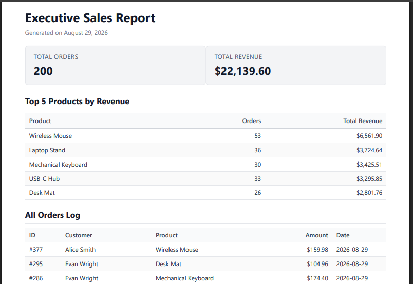

# 📄 Automated PDF Report Generator

A simple end-to-end reporting tool that pulls order data from a database, builds a clean HTML report, and turns it into a downloadable PDF — all through a REST API.

**Built with:** FastAPI · SQLite · Playwright (Headless Chromium)

**What it does:**
- Reads and summarizes order data using SQL
- Builds an HTML/CSS report with proper page breaks
- Converts that report into a multi-page PDF
- Serves the PDF through API endpoints that avoid creating duplicate reports

---

## 📊 1. Dataset

- **Dataset used:** Option A — "The Little Shop"
- **Table:** `orders`

| Column | Type | Description |
|---|---|---|
| `id` | INTEGER (Primary Key) | Unique order ID |
| `customer` | TEXT | Customer name |
| `product` | TEXT | Product name |
| `amount` | REAL | Order amount |
| `created_at` | TEXT (ISO-8601) | Timestamp of the order |

---

## 🚀 2. Getting Started

### Requirements
- Python 3.10+
- [`uv`](https://github.com/astral-sh/uv) (package manager)

### Setup

```bash
# 1. Clone the repository
git clone <YOUR_PUBLIC_REPO_URL>
cd pdf-report-generator

# 2. Install dependencies and the Chromium browser
uv sync
uv run playwright install chromium
```

### Add Sample Data

This fills `report.db` with 200 sample orders spread across the last 30 days. Running it more than once won't create duplicates.

```bash
uv run python seed.py
```

### Run the Server

```bash
uv run uvicorn main:app --reload
```

The API will be running at **http://127.0.0.1:8000**.

---

## 🧮 3. SQL Queries Used

These are the four main queries the report is built from (found in `report.py`):

**Total number of orders**
```sql
SELECT COUNT(*) AS total_orders FROM orders;
```

**Total revenue**
```sql
SELECT COALESCE(SUM(amount), 0.0) AS total_revenue FROM orders;
```

**Top 5 products by revenue**
```sql
SELECT 
    product,
    ROUND(SUM(amount), 2) AS revenue,
    COUNT(*) AS order_count
FROM orders
GROUP BY product
ORDER BY revenue DESC
LIMIT 5;
```

**Daily order activity (last 7 days)**
```sql
SELECT 
    DATE(created_at) AS order_date,
    COUNT(*) AS order_count,
    ROUND(SUM(amount), 2) AS daily_revenue
FROM orders
WHERE created_at >= DATETIME('now', '-7 days')
GROUP BY DATE(created_at)
ORDER BY order_date ASC;
```

---

## 🔌 4. API Endpoints

| Method | Endpoint | What it does |
|---|---|---|
| `POST` | `/reports` | Creates a new report, or returns today's report if one already exists. Pass `{"force": true}` to force a new one. |
| `GET` | `/reports/{id}` | Returns details about a report and a link to download it. |
| `GET` | `/reports/{id}/file` | Downloads the actual PDF file. |

### Example Usage

**Create a report** *(201 = new report, 200 = already exists today)*
```bash
curl -i -X POST http://localhost:8000/reports
```
```
HTTP/1.1 201 Created
{"id": 1, "file": "/reports/1/file"}
```

**Get report details**
```bash
curl -i http://localhost:8000/reports/1
```
```
HTTP/1.1 200 OK
{"id": 1, "path": "reports/report_xxxx.pdf", "created_at": "...", "file": "/reports/1/file"}
```

**Download the PDF**
```bash
curl -o downloaded_report.pdf http://localhost:8000/reports/1/file
```

---

## 🏗️ 5. Design Notes

### When would this move to a background job?

Right now, the report is generated instantly when you call the API. This would need to change if:
- Report generation starts taking longer than ~2–3 seconds (too slow for a normal web request)
- Larger datasets start causing CPU/memory spikes while rendering
- Many people are generating reports at the same time, which could slow down the whole server

In that case, the work would move to a background task queue (like **Celery** or **RQ**) so the API can respond instantly while the PDF is built separately.

### Why prevent duplicate reports?

The app checks if a report already exists for today before making a new one. This avoids:
- Accidental double-clicks creating duplicate reports
- Wasting server resources rebuilding the same PDF over and over

In a real business, skipping this kind of check can cause real problems — like charging a customer twice, or emailing two different payment links for the same invoice.

---

## 🖼️ 6. Report Preview



---
